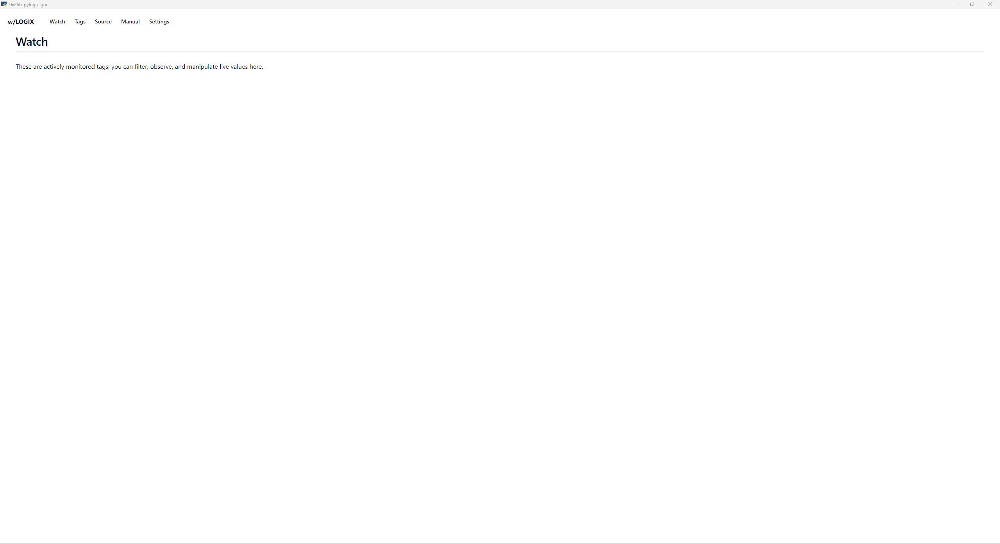
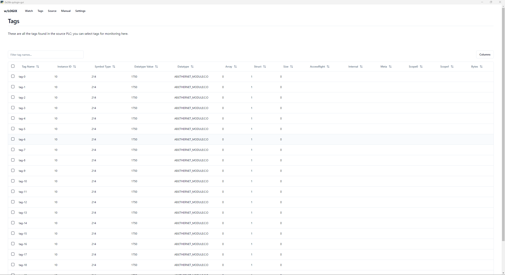
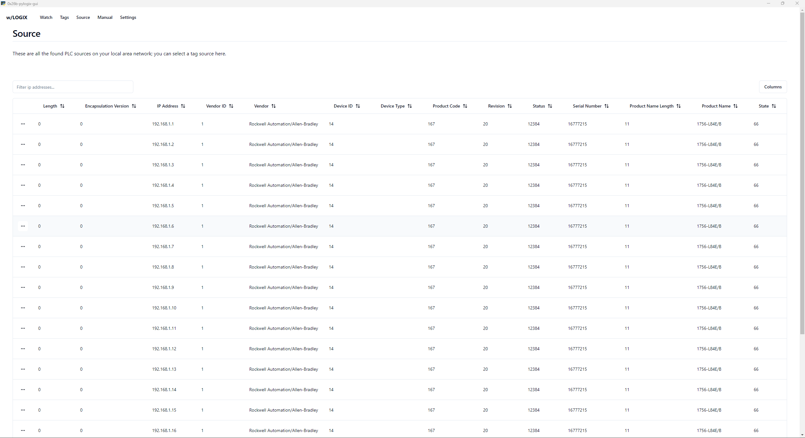
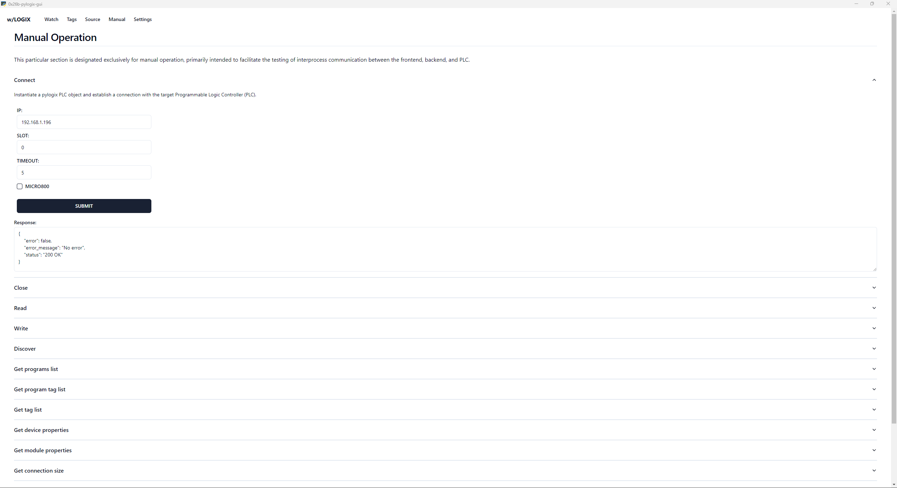
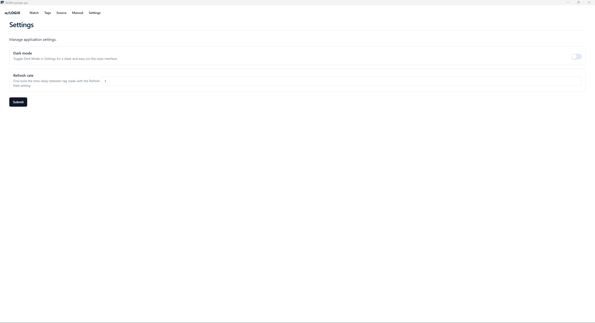

NB: This is currently in heavy development mode, it's a fun project that I work on in my spare time.

This project aims to provide a better tag watching experience than the built in watch table in rockwell studio software.

The idea here is you select a source programmable logic controller (PLC) in the sources tab, then head over to the tags page to select the tags you want to have watched (these are pulled from the source PLC), then lastly head over to the watch screen to observe and manipulate live values.

After all that's working, a later feature will be to add collections to group together tags on the watch page === super useful!

Some preview screenshots:

